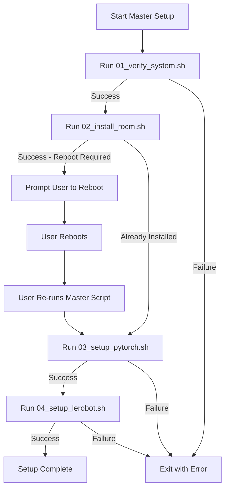

# Setup Scripts Architecture Plan

## Overview
This directory contains shell scripts to automate the setup process described in QuickStart.md. Each script is designed to be:
- **Idempotent**: Safe to run multiple times
- **Error-resistant**: Comprehensive error checking and handling
- **Logged**: All operations logged with timestamps
- **Modular**: Can be run independently or orchestrated

## Script Structure

### 01_verify_system.sh
**Purpose**: Verify system meets prerequisites before installation

**Checks**:
1. Ubuntu 24.04 LTS (noble) is installed
2. Kernel version is appropriate (6.14.0-27-generic or compatible)
3. amdgpu driver is loaded and functioning
4. User is in render and video groups (or can be added)
5. VRAM allocation (informational warning if < 16GB)

**Exit Behavior**:
- Exit code 0: All checks passed
- Exit code 1: Critical failure with detailed error message
- Provides instructions for manual fixes when needed

**Output**: 
- Console output with color-coded status
- Log file: `logs/01_verify_system_YYYYMMDD_HHMMSS.log`

---

### 02_install_rocm.sh
**Purpose**: Install ROCm 6.3.x safely

**Features**:
- Check if ROCm already installed (skip if present)
- Download amdgpu-install package
- Verify package integrity
- Install with --no-dkms flag
- Add user to render/video groups if needed
- Prompt for reboot (required after installation)

**Safety Checks**:
- Verify Ubuntu version before proceeding
- Check available disk space
- Backup existing ROCm config if present
- Verify installation success before completing

**Exit Behavior**:
- Exit code 0: Installation successful (reboot required)
- Exit code 1: Installation failed
- Exit code 2: Already installed (no action needed)

**Output**:
- Console output with progress indicators
- Log file: `logs/02_install_rocm_YYYYMMDD_HHMMSS.log`

---

### 03_setup_pytorch.sh
**Purpose**: Setup conda environment and install PyTorch 2.7.1 with ROCm 6.3

**Features**:
- Check if miniconda is installed (provide instructions if not)
- Create or reuse 'lerobot' conda environment
- Set HSA_OVERRIDE_GFX_VERSION in ~/.bashrc (if not already set)
- Install PyTorch 2.7.1 with ROCm 6.3 support
- Verify PyTorch installation and CUDA availability
- Test GPU detection

**Safety Checks**:
- Verify ROCm is installed first
- Check if environment already exists
- Verify PyTorch version compatibility
- Test torch.cuda.is_available()
- Test torch.cuda.get_device_name(0)

**Exit Behavior**:
- Exit code 0: Setup successful
- Exit code 1: Setup failed
- Exit code 2: Already configured

**Output**:
- Console output with test results
- Log file: `logs/03_setup_pytorch_YYYYMMDD_HHMMSS.log`

---

### 04_setup_lerobot.sh
**Purpose**: Clone and setup LeRobot v0.4.1 development environment

**Features**:
- Check if lerobot conda environment exists
- Install ffmpeg 7.1.1 via conda-forge
- Clone lerobot repository (or use existing)
- Checkout v0.4.1 tag
- Install lerobot in editable mode
- Install feetech servo SDK
- Verify installation

**Safety Checks**:
- Verify conda environment is active
- Check if repository already cloned
- Verify git checkout success
- Test lerobot import

**Exit Behavior**:
- Exit code 0: Setup successful
- Exit code 1: Setup failed
- Exit code 2: Already configured

**Output**:
- Console output with installation progress
- Log file: `logs/04_setup_lerobot_YYYYMMDD_HHMMSS.log`

---

### 00_master_setup.sh
**Purpose**: Orchestrate all setup scripts in correct order

**Features**:
- Run scripts in sequence: 01 → 02 → 03 → 04
- Check exit codes and stop on failure
- Provide overall progress tracking
- Handle reboot requirement after ROCm installation
- Generate summary report

**Flow**:


**Exit Behavior**:
- Exit code 0: All steps completed
- Exit code 1: A step failed
- Exit code 3: Reboot required (resume after reboot)

**Output**:
- Console output with overall progress
- Master log file: `logs/00_master_setup_YYYYMMDD_HHMMSS.log`

---

## Common Features Across All Scripts

### Logging System
- All scripts create timestamped log files in `logs/` directory
- Logs include: timestamp, script name, command output, errors
- Console output is color-coded (green=success, red=error, yellow=warning)

### Error Handling
- Set `set -e` for immediate exit on error (where appropriate)
- Trap errors and provide meaningful messages
- Cleanup on failure (remove partial installations)

### Idempotency
- Check if operation already completed before executing
- Skip unnecessary steps with informative messages
- Safe to re-run after failures

### User Interaction
- Minimal prompts (only for critical decisions)
- Clear progress indicators
- Confirmation before destructive operations

---

## Directory Structure
```
robotics/robotics_2025/setup_scripts/
├── PLAN.md                    # This file
├── README.md                  # User-facing documentation
├── 00_master_setup.sh         # Master orchestration script
├── 01_verify_system.sh        # System verification
├── 02_install_rocm.sh         # ROCm installation
├── 03_setup_pytorch.sh        # PyTorch setup
├── 04_setup_lerobot.sh        # LeRobot setup
└── logs/                      # Auto-created log directory
    └── .gitkeep
```

---

## Usage Patterns

### Pattern 1: Full Automated Setup
```bash
cd robotics/robotics_2025/setup_scripts
./00_master_setup.sh
# Follow prompts, reboot when requested, re-run after reboot
```

### Pattern 2: Step-by-Step Manual
```bash
cd robotics/robotics_2025/setup_scripts
./01_verify_system.sh          # Verify prerequisites
./02_install_rocm.sh           # Install ROCm
sudo reboot                    # Reboot system
./03_setup_pytorch.sh          # Setup PyTorch
./04_setup_lerobot.sh          # Setup LeRobot
```

### Pattern 3: Resume After Failure
```bash
# If step 3 failed, fix the issue then:
./03_setup_pytorch.sh          # Re-run failed step
./04_setup_lerobot.sh          # Continue with next step
```

---

## Testing Strategy

### Unit Testing (Per Script)
- Test with prerequisites met
- Test with prerequisites missing
- Test idempotency (run twice)
- Test error conditions

### Integration Testing
- Full run on clean Ubuntu 24.04 system
- Resume after reboot
- Resume after failure at each step

---

## Implementation Notes

### Script Headers
All scripts will include:
```bash
#!/bin/bash
set -euo pipefail  # Exit on error, undefined vars, pipe failures

# Script metadata
SCRIPT_NAME="$(basename "$0")"
SCRIPT_DIR="$(cd "$(dirname "$0")" && pwd)"
LOG_DIR="${SCRIPT_DIR}/logs"
TIMESTAMP="$(date +%Y%m%d_%H%M%S)"
LOG_FILE="${LOG_DIR}/${SCRIPT_NAME%.sh}_${TIMESTAMP}.log"

# Color codes for output
RED='\033[0;31m'
GREEN='\033[0;32m'
YELLOW='\033[1;33m'
NC='\033[0m' # No Color

# Logging functions
log() { echo "[$(date +'%Y-%m-%d %H:%M:%S')] $*" | tee -a "$LOG_FILE"; }
log_error() { echo -e "${RED}[ERROR]${NC} $*" | tee -a "$LOG_FILE"; }
log_success() { echo -e "${GREEN}[SUCCESS]${NC} $*" | tee -a "$LOG_FILE"; }
log_warning() { echo -e "${YELLOW}[WARNING]${NC} $*" | tee -a "$LOG_FILE"; }
```

### State Management
- Use marker files in `logs/` to track completion: `.step_01_complete`, etc.
- Master script checks markers to resume from correct point

---

## Next Steps

1. ✅ Create PLAN.md (this file)
2. Create README.md with user instructions
3. Implement 01_verify_system.sh
4. Implement 02_install_rocm.sh
5. Implement 03_setup_pytorch.sh
6. Implement 04_setup_lerobot.sh
7. Implement 00_master_setup.sh
8. Test each script individually
9. Test full orchestration
10. Document any issues or edge cases discovered